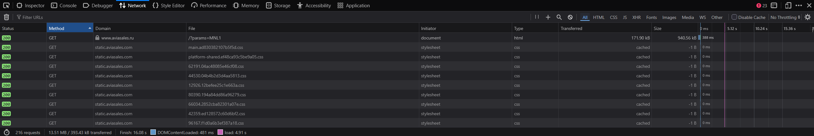
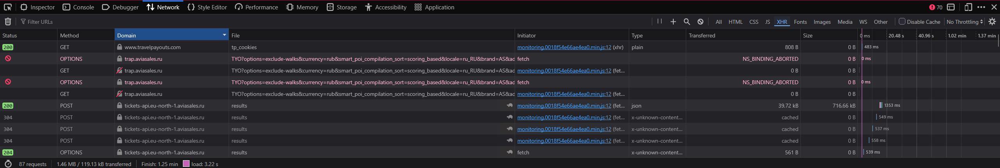
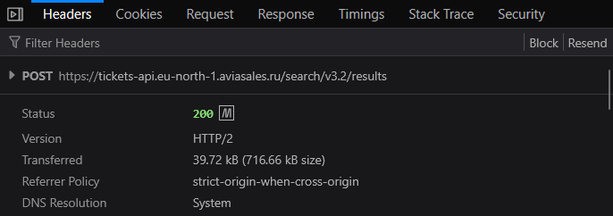
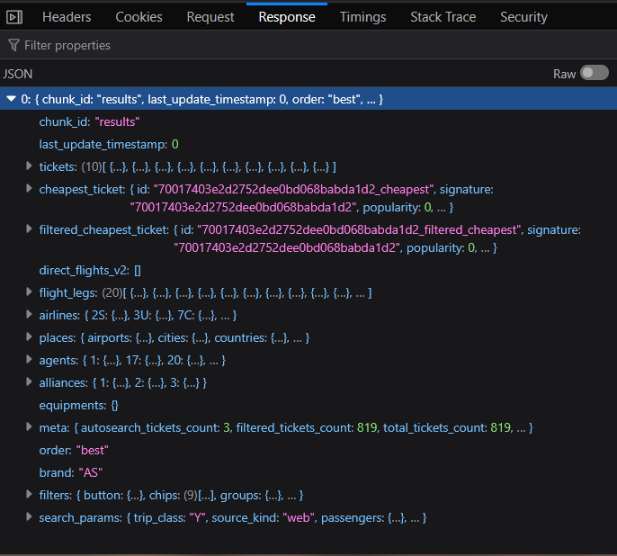
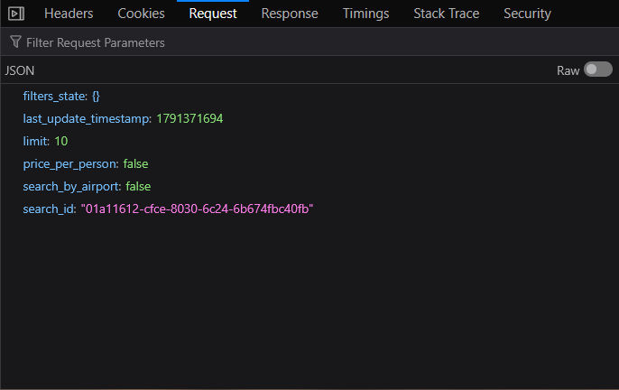
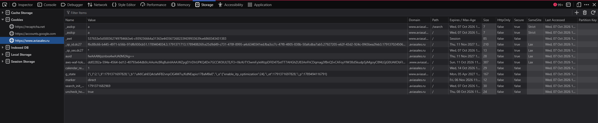

# Лабораторная работа №2

## Анализ веб-приложения и клиент-серверного взаимодействия

## 1. Исследуемая информационная система

**Название:** Aviasales

**Ссылка:** https://www.aviasales.ru/

**Вариант:** 7

**Пользовательский сценарий:** поиск авиабилетов по маршруту.

Лабораторная работа является продолжением исследования, выполненного в лабораторной работе №1. В качестве исследуемого сервиса используется Aviasales, а в качестве пользовательского сценария — поиск авиабилетов по заданному маршруту.

В ходе работы исследуется взаимодействие браузера с сервером, структура HTTP-запросов и ответов, параметры передаваемых данных, cookies, а также связь компонентов Frontend, API и Backend.

## 2. Анализ HTTP-запросов

Для исследования был открыт сайт Aviasales и в браузере использована вкладка **Network** в DevTools. Перед выполнением сценария список ранее выполненных запросов был очищен.

При загрузке страницы браузер выполняет множество HTTP-запросов для получения самой страницы и связанных с ней ресурсов.



На скриншоте видно, что для загрузки страницы используются HTTP-запросы **GET**. Например, запрос к `www.aviasales.ru` возвращает документ типа `html`. Кроме того, выполняются GET-запросы к `static.aviasales.com` для загрузки CSS-файлов.

Таким образом, в ходе исследования были обнаружены как запросы на получение HTML-документа, так и запросы на загрузку статических ресурсов.

### 2.1. Запросы, связанные с пользовательским сценарием

После выполнения поиска авиабилетов в Network был использован фильтр **XHR**, позволяющий сосредоточиться на запросах, выполняемых клиентской частью приложения.



Среди запросов, связанных с получением результатов поиска, обнаружен следующий запрос:

| Метод | Домен | Путь | Статус | Тип | Назначение |
|---|---|---|---:|---|---|
| POST | `tickets-api.eu-north-1.aviasales.ru` | `/search/v3.2/results` | 200 | JSON | Получение результатов поиска |
| POST | `tickets-api.eu-north-1.aviasales.ru` | `/search/v3.2/results` | 304 | cached | Повторное обращение к результатам |
| OPTIONS | `tickets-api.eu-north-1.aviasales.ru` | `/search/v3.2/results` | 204 | — | Служебный запрос перед обращением |
| GET | `www.travelpayouts.com` | `tp_cookies` | 200 | plain | Обращение к внешнему ресурсу |

Основным запросом для дальнейшего анализа выбран **POST `/search/v3.2/results`** со статусом **200**.

## 3. Анализ HTTP-ответов

### 3.1. Заголовки и основные параметры запроса

Для выбранного POST-запроса в DevTools была открыта вкладка **Headers**.



Исследованный запрос:

```text
POST https://tickets-api.eu-north-1.aviasales.ru/search/v3.2/results
```

Основные наблюдаемые параметры:

| Параметр | Значение |
|---|---|
| HTTP-метод | POST |
| URL | `https://tickets-api.eu-north-1.aviasales.ru/search/v3.2/results` |
| Статус | 200 |
| Версия HTTP | HTTP/2 |
| Referrer Policy | `strict-origin-when-cross-origin` |

Запрос выполняется по протоколу HTTPS с использованием HTTP/2. Сервер вернул ответ со статусом **200 OK**.

### 3.2. Содержимое HTTP-ответа

Ответ выбранного запроса представлен в формате JSON.



В JSON-ответе обнаружены следующие группы данных:

| Поле | Назначение |
|---|---|
| `tickets` | найденные варианты авиабилетов |
| `cheapest_ticket` | информация о наиболее дешёвом варианте |
| `filtered_cheapest_ticket` | наиболее дешёвый вариант с учётом фильтров |
| `flight_legs` | данные об участках перелётов |
| `airlines` | информация об авиакомпаниях |
| `places` | данные о городах и аэропортах |
| `agents` | данные об агентствах/продавцах |
| `alliances` | информация об альянсах |
| `filters` | доступные фильтры результатов |
| `search_params` | параметры исходного поиска |
| `meta` | служебная информация о состоянии и количестве результатов |

Таким образом, браузер получает от API не готовую HTML-страницу, а структурированные данные в формате JSON. Эти данные затем используются клиентской частью для формирования страницы результатов поиска.

## 4. Анализ параметров и передаваемых данных

Вкладка **Request** выбранного POST-запроса показывает тело запроса в формате JSON.



В теле запроса наблюдаются следующие параметры:

| Параметр | Значение/описание |
|---|---|
| `filters_state` | `{}`; состояние применённых фильтров |
| `last_update_timestamp` | числовая временная метка |
| `limit` | `10`; ограничение количества результатов |
| `price_per_person` | `false`; режим расчёта цены на человека отключён |
| `search_by_airport` | `false`; поиск не ограничен отдельными аэропортами |
| `search_id` | идентификатор текущего поиска |

Параметры находятся непосредственно в JSON-теле POST-запроса.

В исследованном запросе маршрут и дата поездки непосредственно не отображаются. В теле запроса присутствует `search_id`, поэтому можно предположить, что данный запрос связан с уже созданным поиском и используется для получения или обновления результатов этого поиска.

Данное предположение нельзя считать прямым наблюдением о внутренней реализации сервера: DevTools позволяет увидеть переданные параметры и полученный ответ, но не раскрывает внутреннюю обработку запроса на Backend.

## 5. Анализ cookies

Cookies исследовались в разделе **Storage → Cookies → https://www.aviasales.ru**.



В отчёт не переносятся значения cookies. Рассматриваются только их имена, домены и параметры безопасности.

| Cookie | Домен | Срок действия | HttpOnly | Secure | SameSite | Назначение |
|---|---|---|---|---|---|---|
| `_sp_id.dc27` | `.aviasales.ru` | 11.11.2027 | false | true | Lax | Точное назначение по DevTools не установлено; вероятно, используется для идентификации/сохранения состояния посещения |
| `_sp_ses.dc27` | `.aviasales.ru` | 07.10.2026 | false | true | Lax | Точное назначение по DevTools не установлено; вероятно, связано с текущим сеансом посещения |
| `marker` | `.aviasales.ru` | 06.11.2026 | false | false | Lax | Назначение по данным DevTools однозначно не определяется |

Назначение cookie в таблице указано как предположение там, где его нельзя надёжно определить только по данным DevTools.

Значения cookies намеренно не приводятся, так как они могут содержать идентификаторы или другие служебные данные.

## 6. Взаимодействие Frontend, API и Backend

Для анализа был выбран этап пользовательского сценария, на котором пользователь запускает поиск авиабилетов.

Последовательность взаимодействия можно представить следующим образом:

```text
Пользователь
      ↓
Интерфейс Aviasales
      ↓
Frontend / JavaScript
      ↓
HTTP POST
      ↓
API Aviasales
      ↓
Backend
      ↓
JSON-ответ
      ↓
Frontend / JavaScript
      ↓
Обновление интерфейса
      ↓
Пользователь видит результаты
```

### Описание этапов

1. Пользователь вводит параметры маршрута и даты в интерфейсе Aviasales.
2. Интерфейс передаёт действие клиентской части приложения.
3. Frontend обрабатывает действие пользователя и формирует HTTP-запрос.
4. Браузер отправляет POST-запрос:

```text
https://tickets-api.eu-north-1.aviasales.ru/search/v3.2/results
```

5. На стороне сервера запрос обрабатывается Backend-компонентами.
6. В результате браузер получает JSON-ответ.
7. Frontend обрабатывает полученные данные.
8. Интерфейс обновляется и отображает пользователю найденные варианты перелёта.

Наличие самого HTTP-запроса и JSON-ответа непосредственно наблюдалось в DevTools. Внутренняя реализация Backend не была доступна для прямого наблюдения, поэтому описание внутренних серверных процессов является предположением.

## 7. Сопоставление с архитектурой из лабораторной работы №1

В лабораторной работе №1 была построена общая архитектура Aviasales, включающая пользователя, браузер, интерфейс, клиентскую часть, API, серверную часть, хранилище данных и внешние сервисы.

Результаты второй лабораторной работы позволяют уточнить эту архитектуру.

| Компонент | Результат исследования |
|---|---|
| Пользователь | подтверждён выполнением пользовательского сценария |
| Браузер | подтверждён использованием DevTools и Network |
| Интерфейс | подтверждён взаимодействием с формой поиска |
| Frontend | подтверждён выполнением XHR-запросов и обработкой ответа |
| API | подтверждён реальным POST-запросом к `/search/v3.2/results` |
| Backend | взаимодействие подтверждается через API, но внутренняя реализация непосредственно не наблюдается |
| Хранилище данных | непосредственно не наблюдалось, остаётся предположением |
| Внешние сервисы | наличие отдельных внешних запросов наблюдалось, но роль каждого сервиса не всегда можно определить однозначно |

Основной новой подтверждённой связью является взаимодействие **Frontend → API → серверная часть → JSON-ответ → Frontend**.

Таким образом, результаты сетевого анализа уточняют архитектурную схему из первой лабораторной работы, не позволяя при этом достоверно определить внутреннее устройство Backend и используемых хранилищ.

## 8. Схема взаимодействия компонентов

На основе проведённого исследования была подготовлена отдельная схема выполнения пользовательского сценария поиска авиабилетов.

Схема должна отражать пользователя, браузер, Frontend, API, Backend, хранилище и внешние сервисы, а также направление передачи данных.


### Основные взаимодействия на схеме

- **Пользователь → Браузер:** действие пользователя;
- **Браузер → Frontend:** работа веб-интерфейса и выполнение клиентского кода;
- **Frontend → API:** HTTP POST;
- **API → Backend:** передача запроса на обработку;
- **Backend → Хранилище:** чтение/запись данных — предположение;
- **Backend → Внешние сервисы:** обмен данными — при необходимости, предположение;
- **Backend/API → Frontend:** JSON-ответ;
- **Frontend → Пользователь:** отображение результатов поиска.

Исходный файл схемы должен быть сохранён в:

```text
diagrams/system_interaction.drawio
```

Изображение схемы должно находиться в:

```text
images/system_interaction.jpg
```

## 9. Вывод

В ходе лабораторной работы было исследовано HTTP-взаимодействие веб-приложения Aviasales при выполнении сценария поиска авиабилетов по маршруту.

С помощью DevTools были изучены запросы, выполняемые при загрузке страницы и при работе пользовательского сценария. Были определены используемые HTTP-методы, адреса запросов и статусы ответов. Для основного API-запроса исследован POST-запрос к `/search/v3.2/results`, выполненный по HTTPS с использованием HTTP/2 и завершившийся статусом 200.

Были исследованы параметры JSON-тела запроса и структура JSON-ответа сервера. В ответе обнаружены данные о билетах, перелётах, авиакомпаниях, местах, агентах, фильтрах и параметрах поиска.

Также были рассмотрены cookies сайта и их основные параметры без переноса значений в отчёт. На основе результатов исследования уточнено взаимодействие Frontend, API и Backend и сопоставлены наблюдаемые связи с архитектурой из лабораторной работы №1.

В результате была сформирована отдельная схема выполнения пользовательского сценария, показывающая последовательность передачи данных от пользователя через Frontend и API к серверной части и обратно.
